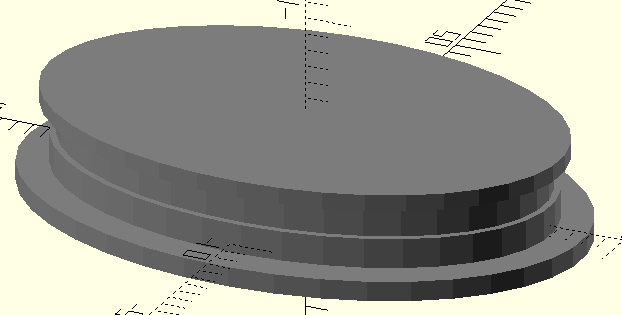

# Diving goggles

What is special about these goggles ?

1. They are a practical way to freedive
2. You can make them yourself

Here is a short comparison chart that illustrates alternatives

|                |  Max depth |  Ear Equalization       | Eye equalization | Field of view | Optical deformations |
|----------------|------------|-------------------------|------------------|---------------|----------------------|
| Diving goggles |  Unknown   |  Hands free (nose clip) | Not needed       | ++            | -                    |
| Normal goggles |  10m       |  Hands free (nose clip) | Impossible       | +++           | -                    |
| Fluid goggles  |  None      |  Hands free (nose clip) | Not needed       | +             | ---                  |
| Diving mask    |  None      |  BTV, Valsava, etc.     | Air from lungs   | +++           | -                    |


# How they work

These are freediving goggles, not swimming goggles. You could conceivably use these
goggles to swim but if you want swimming goggles, I recommend the most cost-effective
and practical solution: go buy a pair from your closest sports store.

The basics of how these goggles work is described in the USPTO patent
[20170203159A1](https://patents.google.com/patent/US20170203159A1/en)
and in the presentation of the indiegogo campaign for 
[Hektometer](https://www.indiegogo.com/projects/hektometer-revolutionary-freediving-goggles#/)
goggles.

Because the patent is abandoned, and, Hektometer goggles have not been available 
for sale since 2020, this project documents how I made a pair for myself using
hardware from my local FabLab, [SoFAB](https://www.sofab.tv/). Even though the principles
of operation are similar, the design is fairly different, to adapt to the production
tools that were available to me and potentially other makers.

# What the result looks like


# Other builds

If, by chance, you decide to make your own based on these instructions, please drop
me a note to let me know how it worked and what you had to change to have a working
pair of goggles.

# How to make one yourself

## What you need

1. For the inner flexible skirt:
   - A resin 3D printer for the mold. I used a [Formlab Form 3B+](https://formlabs.com/3d-printers/form-3b/).
   - Resin for the mold. I used [Grey Pro](https://formlabs.com/fr/boutique/materials/grey-pro-resin/).
   - 12 5x20 threaded screws to hold together the aluminium overmold
   - 10mm thick aluminium plates for the overmold. I bought 2 10x100x500 plates from [Blockenstock](https://www.blockenstock.fr/)
   - Something to cut 10mm tick aluminium plates. I used the services from [Decouplaser](https://www.decouplaser.fr/), a local metal shop
   - A drill press with drill bits (diameter 5) for aluminium.
   - Threading bits for aluminium. Kindly provided by a maker, Guy Mausy.
   - A plastic  injection machine. I used a [Holipress](https://holimaker.fr/holipress/) from [Holimaker](https://holimaker.fr/)
   - TPU Plastic pellets. I used [SEBS 90A](https://boutique.3dadvance.fr/fablab/1199-granules-de-sebs-shore-90a-holimaker), the recommended flex pellets from the machine builder.

2. For the outer rigid shell
   - A resin 3D printer. I used a [Formlab Form 3B+](https://formlabs.com/3d-printers/form-3b/).
   - Resin for rigid parts. I used [Grey Pro](https://formlabs.com/fr/boutique/materials/grey-pro-resin/).

3. For the lenses:
   - Transparent Acrylic/PMMA/Plexiglas sheets (5mm thick).
   - A router. I used an [Origin](https://www.shapertools.com/en-de/origin-overview). A manual router should work too 
     but it might be challenging to make accurate guides for the lens shapes.
   - A grover. I made one with sheets of wood, screws, and a dremel.

4. For the lens clip assembly:
   - A simple extrusion 3D printer. I used a [Prusa MK3](https://www.prusa3d.com/product/original-prusa-i3-mk3s-3d-printer-3/)
   - PETG or PLA filament
 
5. For assembly:
   - A silicon band to attach the left and right side of the goggles. I spent 4 EUR on
     [swedish-style swim goggles](https://malmsten.com/en/products/p/swim-goggles/swedish-goggles/swedish-goggles-classic/2168/2357/1710021)
     to reuse the band that came with them. You should be able to find a similar-looking pair in any swim store online. 
     [Replacement bands](https://malmsten.com/en/products/p/swim-goggles/swedish-goggles/swedish-goggles-spare-part-kit/2168/2357/1750001) 
     can often be bought separately.

## Get the models

It is is easy to download all the [STLs, SVGs, and DXFs](https://github.com/mathieu-lacage/goggles/tree/main/v1)
from this repository.

It is also possible to rebuild these models from the source Python code after you install 
[OpenSCAD](https://openscad.org/) and [SolidPython](https://github.com/SolidCode/SolidPython/):

```
$ sudo dnf install -y openscad
$ pip install SolidPython
$ make release
```

The resulting files will be located in the goggles-XXXX-XX-XX subdirectory.

## Print The shell


I have printed the shell successfully on the 
[SoFAB](https://www.sofab.tv/)'s Formlab resin printer with both 
[Draft](https://formlabs.com/materials/standard/#draft-resin) and 
[Grey Pro](https://formlabs.com/materials/standard/#grey-pro-resin) resin.
The quality difference between the two resins is not visible but I picked
Grey Pro to avoid potential problems with part durabilityy.

I used the Formlab's slicer ([Preform](https://formlabs.com/fr/software/#preform)) 
with its default "magic wand" tool for orientation and support.

## Print the lens clip and assembly clip


The lens clip, and the back clip can be printed without special care on 
your FDM printer of choice. I recommend PETG for durability.

## Cut the lens

The starting point is a 5mm acrylic sheet that needs to be cut to produce
an ellipsoid of the right size with the right profile: 


The `lens.svg` included in the release contains paths that can be loaded into an Origin
router and then used to cut acrylic sheets with a 3mm straight bit:

1. Cut along the exterior of the inner path to 4.3mm
2. Cut along the exterior of the outer path to 5mm.
3. Use a knife and sanding paper to clean gently the sides of the lens

Beware of the thickness variability of acrylic sheets: in practice,
it seems significant (+/- 0.2mm) for the stock I had access to 
so you might need to adjust the depth of the second cut.

## Groove the lens

I considered buying a cheap lens groover that can be found on aliexpress
for less than 60EUR but I ended up making one with a dremel and a couple of wood
planks. I used spare oak planks I had around to support the dremel horizontally
with plywood for the front face:


The front face has a couple of extra plywood pieces to be able to control the
depth of the groove:


Finally, I bought a lens holder to be able to keep my fingers away from the
dremel rotating bit while rotating the lens itself with the holder:


The above setup allows me to cut reliably grooves of the right depth (1mm)
located at the right distance (1mm) from the lens edge. 

## Print the skirt mold


The skirt mold is a two-part mold that should print easily with the magic
wand default settings of PreForm. Again, I used Grey Pro resin which worked
well so far.


## Make an overmold

The skirt mold you printed with your resin printer will work exactly once
and die a noisy death on your first plastic injection. If you want to inject
at least two skirts without printing twice the mold, and if you
want to make sure that the two-part mold does not open during injection, 
I recommend you make or buy an overmold of the right size. I made mine
out of 10mm thick aluminium sheets, as recommended by a local maker.

The dxfs for the 6 parts can be found in the release directory. I got them
cut by a local metal shop, [Decouplaser](https://www.decouplaser.fr/) and my local
mold expert kindly drilled and threaded the missing holes for me. The result
might be a bit overkill but it worked for me.


## Inject skirts

After the overmold is assembled, the skirt mold should fit easily. 
I needed to sand the mold external faces to make them fit tightly within
the overmold. 


After injecting a couple of skirts, I noted the following:

 - Make sure that the screws of the overmold are very tight to ensure
   proper injection without flash.

 - After a couple of injections, the mold will get warmer. It will 
   expand and will be more difficult to insert and remove from the overmold.

 - hold time for the machine and pellets I used is at 10-20s. It seems
   that the hold time depends on the temperature of the mold itself: decrease
   hold time when temperature increases to avoid extra pressure at
   the point where material is injected in the mold.

The skirts should need minimal post-processing: if the overmold is not
sufficiently tight, you might need to remove some flash.

## Assembly

# History
